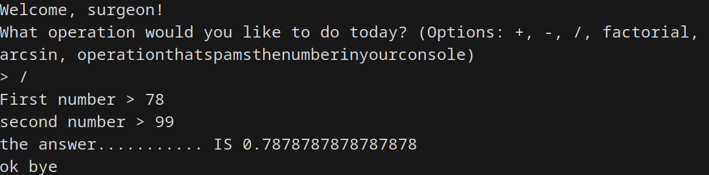
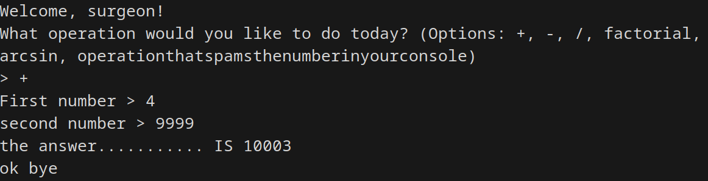

# rusty_calculator_i_found_in_my_attic

This is a super simple CLI calculator app that features addition, subtraction, division, factorial, arcsin, and operationthatspamsthenumberinyourconsole - all the essentials in one place!

This is mainly just to teach me how to code in Rust.

## Building/Running

To run you can just use one of the release binaries (need to run from console!!), or you can build from source using Cargo - `cargo run` to run normally, `cargo build --release` to compile to binary.

## Donating

To donate and support this incredible project, please mail a check to this address:
8605 Santa Monica Blvd #86294 West Hollywood, CA 90069